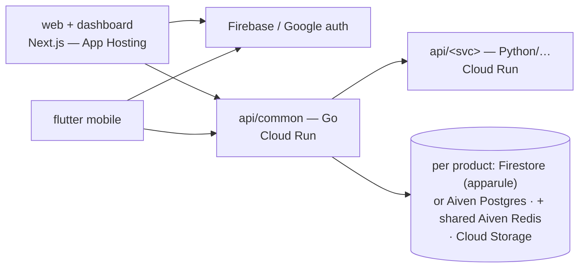

# CueLABS™ Engineering Standards

This skill encodes how CueLABS™ repositories are structured so a coding agent can
**bootstrap a new repo** or **standardize an existing one** consistently.
Scaffolding is just directory creation, file templates, and standard tool
invocations (`create-next-app`, `go mod init`, …), all of which an agent does
directly — and an agent can also refactor an existing repo in place.

The reference implementation is **cuesoftinc/apparule** — when in doubt, mirror it.

## Canonical structure

```
api/
  common/            Go backend — auth + core API. ALWAYS named "common".
  <service-name>/    Additional services, named by FUNCTION not language:
                     e.g. measure (apparule, Python pose), observability
                     (upstat, Python), image (TS/Node file service).
web/                 Next.js marketing site + dashboard
mobile/
  flutter/           Primary cross-platform app (Dart)
  android/           Native Android (Kotlin) — placeholder until built
  ios/               Native iOS (Swift) — placeholder until built
deploy/
  docker/            Extra container assets (compose itself lives at the repo root)
  helm/              ONE standard-form chart that deploys ALL services (incl. Envoy) to k8s
  terraform/         Cluster-agnostic IaC: installs the Helm chart via kubeconfig
docs/                overview.md, setup.md (+ optional api/, architecture.md)
scripts/             Developer / CI helper scripts
```

Plus the root files listed under **Community health & config** below.

### Naming rule (important)
`api/common` is the shared Go backend in every repo. Every **other** service is
named by what it *does* (`measure`, `observability`, `image`), **never** by its
language (`go`/`python`/`nodejs`). Only create a service directory when a real
service exists — do not add empty `api/image` placeholders.

## Community health & config (required root files)

**These files must have parity across all CueLABS™ repos** — byte-identical,
sourced from [`templates/`](templates/). Only `README.md`, `CHANGELOG.md`,
and `.github/dependabot.yml` are repo-specific (repo overview, its own history,
and its own manifest scoping); everything else in the table below — including the
compose-driven `Makefile` — is identical across repos.

| File | Purpose |
|------|---------|
| `README.md` | Overview, architecture diagram, repo structure, getting started, links |
| `CONTRIBUTING.md` | Fork/branch flow, Conventional Commits, review, layout |
| `CODE_OF_CONDUCT.md` | Contributor Covenant 2.1 |
| `SECURITY.md` | Private vulnerability reporting; secret-handling rules |
| `CODEOWNERS` | Default reviewers |
| `CHANGELOG.md` | Keep a Changelog format |
| `LICENSE` | Project license |
| `.gitignore` | Must NOT ignore `.dockerignore`; must ignore `.env*`, secrets |
| `.dockerignore` | Root byte-identical; plus one per build context (repo-specific, see `templates/dockerignore.*`) |
| `.editorconfig` | Shared editor settings (tabs for Go) |
| `Makefile` | Compose-driven standard targets (up/down/build/logs/…); identical across repos |
| `.env.example` | Root env template: per-service sections, dev-safe defaults, `NEXT_PUBLIC_*` block |
| `.github/dependabot.yml` | **Scoped per manifest**, grouped per ecosystem |
| `.github/PULL_REQUEST_TEMPLATE.md` | PR checklist |
| `.github/ISSUE_TEMPLATE/` | bug_report, feature_request, config.yml |

**What's in `templates/`:** ready-to-copy `LICENSE`, `CODEOWNERS`,
`CONTRIBUTING.md`, `CODE_OF_CONDUCT.md`, `SECURITY.md`, `PULL_REQUEST_TEMPLATE.md`,
`ISSUE_TEMPLATE/*`, `Makefile`, a `dependabot.example.yml`, an `env.example`,
Docker templates (`Dockerfile.go`, `Dockerfile.web`, `Dockerfile.python`,
`docker-compose.example.yml`, per-context `dockerignore.*`), the standard-form
Helm chart skeleton (`helm/`), and cluster-agnostic terraform (`terraform/`). Dotfile templates are stored
**without** a leading dot so they stay visible and are never applied to this repo
by accident — when adopting them, copy `templates/gitignore` → `.gitignore`,
`templates/dockerignore.root` → `.dockerignore`, and `templates/editorconfig` →
`.editorconfig`.

`dependabot.yml` is the one config that is **not** identical across repos: it
lists one `updates` entry per real manifest directory (`gomod /api/common`,
`pip /api/<python-service>`, `npm /web`, `pub /mobile/flutter`), grouped per
ecosystem, and **must not** point at dead/deprecated directories. It has **no**
`github-actions` entry — the CI workflows (`build-and-test.yml` +
tag-gated `release.yml`) are org canon kept BYTE-IDENTICAL across repos
and updated deliberately in canon passes, never by a per-repo bot.

## Service structure (production)
When bootstrapping or standardizing a service, **migrate existing code into
these layouts** — don't scaffold empty projects.

**Every service directory** (each `api/*`, `web`) carries its own internals,
consistent across repos: `README.md` (layout/run/config/test), `.gitignore`,
`.dockerignore` (see `templates/dockerignore.*`), and `.env.example` with the
service's native-run variables (compose users rely on the root `.env`).
Go module paths are canonical: `github.com/cuesoftinc/<repo>/api/common`.

**Go (`api/common`):**
```
cmd/server/main.go            entrypoint: slog JSON, config → deps → graceful shutdown
internal/config/              typed env config (fail-fast on missing secrets)
internal/handler/             thin HTTP/gRPC handlers
internal/middleware/          slog logging, request-id, CORS allowlist, recovery
internal/model/  internal/service/  internal/repository/  internal/router/
internal/util/   internal/proto/ (generated)
```
Singular package names. `/health` + `/ready`, `$PORT` (8080), structured `slog`,
graceful shutdown on SIGINT/SIGTERM. gRPC services multiplex gRPC + `/health`
over `$PORT` via h2c.

**Python (`api/<service>`, FastAPI):**
```
app/main.py app/config.py     FastAPI + lifespan (load models/clients once)
router/  service/  model/  repository/   (+ domain pkgs, e.g. ml/, analysis/, database/)
```
Singular folders. `lifespan` (never `@app.on_event`), `/health` + `/ready`, uvicorn,
non-root image, pinned deps.

**Next.js (`web`):**
```
src/app/                      routes — home at `/`, product dashboard at `/dashboard`
src/{components,lib,hooks,types,config,context}   src/proto/ (generated grpc-web, verbatim)
```
Minimal root `layout.tsx` (html/body — plus a CSS-in-JS registry only where the
repo uses one); the home page
renders its own shell; `/dashboard` gets a nested `layout.tsx`. `@/*` → `./src/*`,
`output: "standalone"`.

**Flutter (`mobile/flutter`):**
```
lib/main.dart
lib/src/features/<feature>/   lib/src/core/{theme,localization}
lib/src/services/  lib/src/shared/{,model}   lib/l10n/ (generated — stays)
```
Prefer `package:` imports over relative so moves are mechanical.

### File & folder naming (uniform across repos)
Same language ⇒ same conventions; each project keeps its own *features*.

| Language | Folders | Files |
|----------|---------|-------|
| Go | lowercase, **singular** package (`handler`, `service`, `model`, `repository`, `router`, `util`, `config`, `middleware`, `proto`) | `snake_case.go` |
| Python | lowercase, **singular** (`router`, `service`, `model`, `repository`) | `snake_case.py` |
| Next / TS | **kebab-case** (`shared-layouts/`, `change-password/`) | **Components PascalCase** (`NavBar.tsx`); modules/hooks/styles/types **kebab-case** (`use-auth.ts`, `home-context.ts`, `nav-bar.styles.ts`); Next reserved lowercase (`page.tsx`, `layout.tsx`, `route.ts`) |
| Dart | `snake_case` | `snake_case.dart` |

Generated code (`proto/`, `*_pb.*`, grpc-web clients) keeps its generated names — never rename it.

## Deploy convention
A single `deploy/helm` chart deploys **all** services — including the Envoy
gRPC-Web proxy where used — into a Kubernetes cluster. Do **not** create a
standalone `deploy/envoy/`; Envoy config lives inside the Helm chart.

The chart is standard-form (see `templates/helm/`): split
`deployment.yaml`/`service.yaml` ranging over a `services:` values map,
`_helpers.tpl` with the k8s recommended labels (name/instance/part-of/chart),
liveness+readiness probes (`healthPath`/`readyPath`, tcp fallback),
`runAsNonRoot`, `resources`, and `NOTES.txt`. Envoy's config is embedded via
`.Files.Get` in a ConfigMap. Always `helm lint` + `helm template` before
shipping.

Chart gotchas that cost real time:
- Pods run `runAsNonRoot` with a **numeric** `runAsUser` (default 10001;
  web images run as `node` = 1000, Envoy as 101) — kubelet cannot verify
  named users and rejects the pod otherwise.
- **Bump `Chart.yaml` version on every chart change** — the terraform helm
  provider does not upgrade local charts whose version is unchanged.
- Images live under the `cuesoft` Docker Hub org: `cuesoft/<repo>-<service>`.

`deploy/terraform` (see `templates/terraform/`) is **cluster-agnostic**: the
helm provider authenticates via kubeconfig (`kubeconfig_path`/`kube_context`
variables) and installs the repo chart — no cloud-specific providers.

## Local development (Docker)
Each repo has a root `docker-compose.yml` and a compose-driven `Makefile`
(`make up` / `make down` / `make logs` / `make build`). Copy `.env.example` →
`.env` first. Service packaging (see `templates/Dockerfile.go`,
`templates/Dockerfile.web`, `templates/docker-compose.example.yml`):

- **Go services** — multi-stage, static binary (`CGO_ENABLED=0`), non-root user,
  honors `$PORT` (default 8080), `/health` HEALTHCHECK.
- **Next.js web** — `output: "standalone"` + multi-stage build that runs
  `node server.js` as the non-root `node` user (never `npm run dev` in an image).
- **Python services** — `templates/Dockerfile.python`: `python:3.12-slim`,
  non-root uid 10001, PORT-aware 127.0.0.1 `/health` healthcheck with a long
  start period (model loads), `uvicorn app.main:app`.
- **gRPC-Web repos** — run Envoy in compose (image pinned, config mounted from
  `deploy/helm/envoy/envoy.yaml`, backend network-aliased to the cluster
  target); Envoy takes the next port slot (e.g. upstat :8082) and the web image
  gets `NEXT_PUBLIC_ENVOY_URL` as a build arg.

**Port convention (parity across repos):** so muscle memory carries between
services, every repo publishes the same host ports — `api/common` → **8080**,
`web` → **3000**, and each additional API increments from there (**8081**, 8082, …;
e.g. apparule's `api/measure` → 8081). Compose sets `PORT` and the published port
to the same value, and the web image's `NEXT_PUBLIC_BASE_URL` build arg targets
`http://localhost:8080`.

Gotchas that cost real time:
- Build the web image on **`node:*-slim` (glibc), not Alpine** — Next 16's
  Turbopack build workers are unreliable on musl.
- Keep **TypeScript on 5.x**; Next's build-time TS check crashes on the
  TypeScript 7 native compiler. Dependabot npm-group PRs can silently bump
  `typescript`/`eslint`/`@types/node` to breaking majors — pin them.
- `NEXT_PUBLIC_*` are inlined at build time → pass them as Docker build args.
- **SSR safety**: never touch `localStorage`/`window` during render — only in
  `useEffect`/handlers (or behind `typeof window !== "undefined"`); prerender
  crashes otherwise. Session state that both client and shell components need
  belongs in cookies, written and read by the same names.
- All healthchecks (web and APIs) target `127.0.0.1`, never `localhost`
  (IPv6 resolution causes false-unhealthy containers).

## Cleanup rules (when standardizing)
Remove (safe — not application code):
- **All GitHub Actions workflow files** (`.github/workflows/**`, or misplaced
  workflow YAMLs directly under `.github/`). CI is not part of this standard.
- Buggy/one-off scripts (e.g. old `refactor-structure.sh`).
- Stale planning/aspirational docs that no longer match reality.
- Generated artifacts committed by mistake (e.g. `output_landmarks.jpg`),
  committed build binaries, `tmp/` output.
- Dead `.gitkeep` files in directories that now hold real content.

Never remove:
- **Application code**, service assets/models, or test fixtures.
- Placeholder `.gitkeep`s in genuinely-empty standard dirs (`deploy/*`,
  `mobile/android`, `mobile/ios`, `scripts`).

## Procedure A — standardize an existing repo
1. Branch `chore/standardize-structure`.
2. Move services into place with `git mv` (preserves history). `api/common`
   (Go) stays put — its module path is unaffected. Rename functional services
   (e.g. `reliability-service` → `observability`).
3. `git grep -n <old-path>` and update every reference (Dockerfiles, compose,
   Makefile, docs, CI). Go modules with logical/bare module names are unaffected
   by folder moves; only path-based module names need a `go.mod` + import
   rewrite.
4. Add the community-health/config files (mirror apparule, adapt content).
5. Create any missing standard dirs (`deploy/{docker,helm,terraform}`, `scripts`)
   with `.gitkeep` placeholders.
6. Apply the cleanup rules above.
7. Verify: build/imports intact, `git status` clean, no app code deleted.
   Open a PR (do not self-merge without review).

## Procedure B — bootstrap a new repo
1. Create the structure above (only the services you actually have).
2. `web`: `npx create-next-app@<version>` (see versions).
3. `api/common`: `go mod init github.com/cuesoftinc/<repo>/api/common` + Gin.
4. `mobile/flutter`: `flutter create`.
5. Add all community-health/config files from `templates/`.
6. Wire `deploy/helm` to deploy every service.

## Architecture conventions

- Auth: Firebase Authentication, **Google sign-in ONLY** — no username/password
  signup or login anywhere in the ecosystem. Enforce at three layers:
  Email/Password provider disabled on the Firebase project; backends reject
  tokens with `sign_in_provider != google.com`; UI ships exactly one
  "Continue with Google" CTA. Sandbox identity project: `sandbox-e306a`;
  `account.cuesoft.io` is a future facade over the same Firebase project.
- Identity, profile & KYC tiers (X-10): layered on the auth standard above —
  Google sign-in stays the sole credential; tiers add profile data and
  verification, **never alternative logins**. **Tier 0 — Google identity**
  (all products): firebase_uid + Google-verified email; grants all read/basic
  use. **Tier 1 — self-attested profile & location** (captured in product
  profile/settings; sensitive PII, never logged): apparule = bio + profile
  location {city, state, country} powering proximity-ranked designer
  recommendations and delivery-address pre-fill (the delivery address itself
  stays frozen per order); expendit = tax-jurisdiction location
  (state_of_residence for individuals, registered_address for company orgs)
  which resolves the remittance authority (State IRS vs FIRS); upstat = org
  timezone (IANA) only, for report rendering and time-bucketing —
  deliberately the entire upstat requirement. **Tier 2 — provider-verified
  financial identity** (only where money moves or government filings
  generate): store provider refs + verification state, **never raw
  government IDs** — apparule designer payouts = Paystack BVN-backed bank
  resolution (the ecosystem pattern); expendit filing identity = TIN
  (+ RC number + registered address for companies) gated at filing-pack
  generation; upstat = N/A until billing enters the PRD. Rules: tiers gate
  capabilities, never sign-in; KYC state machines + error codes live in flow
  docs (apparule's kyc_incomplete/post_unavailable is the template); tier-2
  fields are high-sensitivity in every data-model.md §4 classification;
  verification is delegated to the money/filing provider — no in-house
  document review.
- Backends deploy to GCP Cloud Run (provisioned via the `cuesoft-iac` Pulumi
  ecosystem — never ad-hoc); frontends deploy to Firebase App Hosting; the
  Helm chart remains the self-host path.
- AI features use **Vertex AI** (Gemini via `aiplatform.googleapis.com`, ADC —
  see `cuesoft-iac/functions/cueprise-gemini-proxy`); no consumer AI-vendor
  API keys in cloud deployments. Self-host fallback: BYO Gemini/Groq env keys.
- Environments & deploy gating: `stg` = sandbox is the ONLY environment for
  CueLABS™ products (no production); Doppler config `stg` holds its secrets.
  **Open-source deviation from the cueprise flow**: merge-to-main never
  deploys (build+test only); deploys fire **only on `v*` tag creation**,
  gated by a tag ruleset (owner-level) + protected GitHub environment.
- **GitHub Actions standard (uniform across repos, ratified 2026-07-18)**:
  exactly two workflow families, identical names and shape in every repo —
  `.github/workflows/build-and-test.yml` (workflow name `build-and-test`;
  triggers `push: branches [main]` + `pull_request`, no path filters —
  surfaces join as jobs; `permissions: contents: read`; `concurrency:
  build-and-test-${{ github.ref }}` with cancel-in-progress; one job per
  surface: `web` = "web · lint + typecheck + unit + build" on Node 22
  (`npm ci → lint → typecheck → test → build`), `web-e2e` = "web ·
  Playwright (TEST_MODE)" (`playwright install --with-deps chromium →
  test:e2e`), api/mobile jobs follow the same naming pattern; action steps
  pin the LATEST major of official actions — currently
  `actions/checkout@v7`, `actions/setup-node@v7`,
  `actions/upload-artifact@v7` (verify via
  `gh api repos/actions/<name>/releases/latest` when touching workflows,
  never copy stale versions from older files). **Shared jobs are
  BYTE-IDENTICAL across repos** (2026-07-18: one canonical file, same
  shasum in all three products) — repo variance lives in `package.json`
  scripts, never in workflow YAML; named steps only (Checkout · Setup Node ·
  Install dependencies · Lint · Typecheck · Unit & integration tests ·
  Build (TEST_MODE with `NEXT_PUBLIC_TEST_MODE: "1"`)); the e2e job builds
  in TEST_MODE, installs chromium, runs `test:e2e` with TEST_MODE+CI env,
  and uploads `web/playwright-report` as artifact `playwright-report`
  (retention 7) on failure) and the
  tag-gated `release.yml` (X-6; getpp/cueprise are the deploy-pattern
  references). New workflow files beyond these two families are a standards
  deviation and need ratification.
- **Test layout standard (uniform across repos, 2026-07-18)**: unit/
  integration tests co-locate with their source as `<name>.test.ts(x)`
  (component `Button.test.tsx` beside `Button.tsx`; kebab for module tests);
  Playwright e2e specs live in `web/e2e/<flow>.spec.ts` (flow names mirror
  the design.md §8.4 prototype journeys) with `playwright.config.ts` at the
  web root; npm scripts are `test` (unit), `test:e2e` (Playwright), `lint`,
  `typecheck` in every web app.
- Transactional email: **Brevo REST API** only (`BREVO_API_KEY/FROM_EMAIL/
  FROM_NAME` via Doppler; irealty is the reference) — **no SMTP** in any
  CueLABS™ product.
- Data plane (cloud): per-product choice of **Aiven Postgres** or **Firestore**
  (Firebase-native/real-time products → Firestore; financial/relational →
  Postgres). Shared **Aiven Redis** with `REDIS_DB`-index tenancy per
  product/config (irealty pattern: discrete `REDIS_*` vars). **Doppler** is
  the env source of truth — project per repo, configs `dev / dev_personal /
  stg / prd`. Object storage: the sandbox project's default **Cloud Storage** bucket
  with per-product/env prefixes. Self-host compose bundles its own stores.
- Protocols (X-8): **HTTP/JSON everywhere**; gRPC only where the domain
  demands it (upstat: OTLP ingest + internal s2s; its browser gRPC-Web/Envoy
  path is sunsetting at monitors-v2). Cloud Run requires end-to-end HTTP/2
  (h2c) for gRPC services. Self-host Helm still deploys Envoy while the
  gRPC-Web path exists.

## Documentation standard (docs/)

Every product repo carries the same docs set (GitBook Git-synced via
`.gitbook.yaml`, nav in `docs/SUMMARY.md`; doc H1s are
`<Product> — <Title>` and the SUMMARY nav label is exactly the H1 minus
the product prefix — e.g. `# Apparule — Web Implementation Standard` →
`[Web Implementation Standard](web-implementation.md)`; labels must match
across repos):
`overview.md setup.md prd.md decisions.md roadmap.md design.md pages.md
architecture.md data-model.md api.md engineering.md deployment.md features.md
flows/ (auth + core product flows) api/openapi.yaml` + product-specific
contracts (e.g. tax-engine, capture-qc, analytics-math, query-grammar).
Claims are marked **[Current] / [PRD] / [Directive] / [Proposed] / [Decided]**;
`decisions.md` is the ratification register — other docs defer to it.
`features.md` is the granular build backlog (stable IDs, referenced in PRs as
`feat(F0-3): …`).

**Canonical section skeletons** (same H2 spine in every repo; product-specific
deep-dive sections slot between the fixed ones):
- `prd.md`: Product definition · Personas/JTBD · Functional requirements ·
  Non-goals · Brand & content · Compliance & safety · Success metrics · Open
  questions · Scope expansions (dated).
- `architecture.md`: 1 Context—current · 2 Context—target · 3 Service
  breakdown · 4 Core sequences · (product deep-dives) · Deployment view ·
  Cross-repo dependencies · dated expansion sections.
- `data-model.md`: Current entities · Target additions · Storage/identity
  mapping · Classification & retention · dated expansions.
- `api.md`: Current surface (+ topology table where multi-service) · Target
  surface · Gap analysis · Conventions · dated expansions.
- `engineering.md`: Error catalog · Authz matrix · Rate limits · Testing ·
  Logging · Acceptance · CORS contract.
- `deployment.md`: Topology · Provisioning (cuesoft-iac) · CI/CD (tag-gated,
  X-6) · Runtime contract (sizing/domains/rollback) · Not in this phase.
- `design.md`: Principles · Foundations (incl. the shared block) · Components ·
  MI catalog · Accessibility & motion · Platform parity · Figma Style Guide.
- `pages.md`: Part A home · Part B dashboard · Part C mobile · feature
  register delta. `features.md`: Phase tables (ID/unit/delivers/refs/deps) +
  cross-phase units. `flows/*`: numbered contract sections ending in
  Instrumentation & Acceptance.
- All mermaid diagrams must parse (validate with mermaid-cli before merge —
  invalid blocks render as plaintext on GitBook); no ASCII diagrams.
- Landing dual-audience rule: the product landing page (`pages.md` Part A)
  must sell to **both** contributor-developers (stack, interesting problems,
  good-first-issues, community links) and self-hosting adopters
  (data-ownership pitch, one-line install, what ships) — with an FAQ.

## Ecosystem API conventions

- Versioned base path `/api/v1` (products) — upstat's public surfaces use
  `/v1` (events/stats/query are cross-product infrastructure).
- Error envelope `{"error": {"code", "message", "details?"}}`; codes are
  **snake_case and stable**, owned by the flow docs (never invented in code
  review). Cross-tenant access returns `404`, never `403`.
- Cursor pagination (`?cursor=&limit=`, default 50).
- `Idempotency-Key` header on any client-retryable mutation (uploads,
  payments, submissions) — retries must never duplicate.
- Rate limits per engineering.md; `429` + `Retry-After`.
- Auth: Firebase ID-token bearer (Google-only); machine identities
  (service tokens, property keys) never grant user-API access.

## Telemetry standard (OpenTelemetry, X-9)

Every service instruments with **OTel SDKs**: traces (auto-instrumentation
for HTTP/gRPC/DB clients + manual spans on domain operations), custom
metrics (Meter API: counters/histograms per service KPIs), logs (slog/logging
bridges). W3C `traceparent` propagates across all service boundaries.
Export = **direct OTLP from the SDK** (BatchSpan/LogRecord processors);
collector sidecar = later upgrade path, never a v1 requirement. **Receiver =
upstat's OTLP gateway** (4317 gRPC / 4318 HTTP, ingest-key header; sibling
exporters default to OTLP/HTTP — only upstat ever hosts gRPC, X-8) — CueLABS™
products dogfood upstat for their own observability. Export is env-gated:
no OTEL_EXPORTER_OTLP_ENDPOINT → SDK no-ops (pre-OBS-001 posture). JSON
stdout logging remains alongside (Cloud Run native). Operational telemetry
≠ product analytics events (upstat /v1/events) — separate pipelines, never
mixed. Env: OTEL_SERVICE_NAME, OTEL_EXPORTER_OTLP_ENDPOINT,
OTEL_EXPORTER_OTLP_HEADERS, OTEL_RESOURCE_ATTRIBUTES.

## Environment-variable naming standard

Identical names across all repos (Doppler `<project>/stg` is the source of
values; `.env.example` documents names with dev-safe defaults):
`PORT` · `CORS_ORIGINS` (comma-separated exact origins — the only CORS var;
never ALLOWED_ORIGINS/FRONTEND_URL) · `REDIS_HOST/PORT/USERNAME/PASSWORD/TLS/DB`
(discrete, irealty pattern) · `BREVO_API_KEY/FROM_EMAIL/FROM_NAME` ·
`GOOGLE_CLOUD_PROJECT` · `SERVICE_TOKEN_HASH` (server side of s2s token
validation) · DB: `MONGO_URI`+`MONGO_DB` (Mongo era) / `DATABASE_URL`
(Postgres era) / ADC for Firestore. CORS behaviour contract lives in each
repo's engineering.md ("CORS contract" section).

## Analytics events rule

Upstat's `docs/api.md` consumer registry is the **master event registry** for
the ecosystem. Events are counters + registered coarse dims only — never
measurement values, amounts, descriptions, or PII. Adding an event = update
the registry first, then instrument.

## Design documentation standard

Each repo's `design.md` defines: reference feel, color tokens (mirrored as
Figma variables in `<product>/tokens` with **true Light/Dark modes**; plus
foundations variables — spacing, radii, durations, z-index — in the same
collection), type scale,
layout, component inventory, a numbered microinteraction catalog (`MI-n`,
referenced from pages.md), accessibility/motion rules, and the **shared
foundations block** — spacing scale (4px grid: 4/8/12/16/24/32/48/64),
breakpoints (640/768/1024/1280/1536), motion durations (120/200/250/300ms) +
easings, z-index layers (0/10/20/30/40/50), **Lucide** icons, focus ring
(2px accent, offset 2, :focus-visible). The foundations rows are identical
across products — changing one is an ecosystem PR touching all three.

**Docs describe the current system** (ratified 2026-07-19): design docs are
a snapshot of what is on `main` NOW, not a changelog. Decision markers
(`[Decided …]` / `[Directive …]`) and as-built notes describing the current
construction stay; archaeology does not — once a replacement lands, clauses
like "replaces X", "drops Y", "formerly Z", references to retired legacy
trees, or pointers at Deprecated-page parking are removed in the same pass
(git history and PRs are the changelog).

### Figma component-library standard

How each product's Figma library is built (ratified from the
apparule/expendit/upstat library builds, 2026-07):

- **Token pairing** — every accent/brand fill token pairs with an
  `on-accent`/`on-brand` color token for the ink rendered on it. Raw hex is
  allowed **only** for documented exceptions: on-media camera UI, gradient
  stops (Figma cannot bind variables to them), effect/shadow colors, and
  crit-fill labels pending an `on-crit` token.
- **Theme delivery** — dark mode ships as **true Light/Dark variable modes**
  on `<product>/tokens`, never as `theme` variant axes on components.
  Both-mode QA preview frames with **live instances** are mandatory.
- **Library organization** — the Components page holds an "About" README
  card + stage frames in one left-aligned column (240px gaps), with QA
  frames in a parallel right column. File page order: Style Guide →
  Components → (Assets) → surfaces → Deprecated. Run a zero-overlap check
  before shipping.
- **Naming** — PascalCase component sets; lowercase variant properties
  (`kind`, `size`, `state`, …); icons `icon/<lucide-slug>`, brand glyphs
  `icon/brand-<name>` (brand marks keep their official colors, unbound).
  The ecosystem auth CTA component is **`GoogleAuthButton`** (X-1).
- **Engineering practices** — auto-layout everywhere; every color
  variable-bound; tint overlays are instance-safe rects using **node-level**
  opacity (Figma drops paint-level opacity on variable-bound instance
  fills); component descriptions carry the MI/motion notes and **[Decided]**
  mappings that apply to them; OpenType tabular figures (`tnum`) must be
  toggled manually — the plugin API cannot set font features. Two more
  API gotchas [2026-07-20]: the `description` write path HTML-escapes
  quotes/angle-brackets/ampersands at storage (write entity-safe —
  typographic quotes, no `<` or `&`), and page enumeration must use a
  read-only `figma.root.children` call (the no-nodeId listing returns
  only loaded pages).
- **Content** — photography must be licensed, with attributions rendered on
  the Assets page; screens assemble from component instances **only**.
- **Canvas hygiene** — design canvases carry **product copy only**; spec
  annotations (MI references, requirement IDs, implementation notes) belong
  in component descriptions and the docs, never inside screen frames.
- **Design accuracy** — marketing/design surfaces carry **no fabricated
  third-party statistics** (GitHub stars, member/user/download counts), no
  invented pricing or plan claims (until pricing is decided the only
  permitted lines are "self-hosting is free forever" / "cloud pricing
  announced at GA"), no invented SLAs or research statistics, and no
  implied customer endorsements. Product claims are framed as
  targets/capabilities ("we target ±2 cm"), demo data is clearly synthetic,
  and license claims match the repo `LICENSE` (all three products: MIT).
  GitHub badges render as glyph + "Star" with **no count**. (Ratified from
  the 2026-07-18 sweep — all three products had independently violated
  this.)
- **Screen states** — every data-driven screen template ships **default +
  empty + loading** frames: empty uses the `EmptyState` component with real
  first-run copy (plus a demo-data toggle where the product specs one);
  loading uses `Skeleton` primitives.
- **Prototyping standard** — core journeys are wired as **named flow
  starting points** per page. Conventions: `ON_CLICK` → `NAVIGATE`;
  `DISSOLVE` 150-200ms for nav/tab switches; `SMART_ANIMATE` for
  pushes/backs; `AFTER_TIMEOUT` for async verification states.
  Empty/loading/QA/index frames stay out of the flow. Reachability is
  proven by BFS over the reaction graph — no unreachable core screens, no
  dead ends besides terminals. Cross-page links use the
  **move-wire-restore** technique: the API rejects creating cross-page
  `NAVIGATE`, but reactions persist when the source frame is temporarily
  moved to the destination page, wired, and returned.
- **Design QA loop** — before design sign-off, run audit → fix → re-verify
  rounds to convergence with **independent auditors** (not the builders)
  across three lenses: **completeness** (docs contract + states +
  prototype graph), **content** (wording, geometry on the 4px scale,
  placement, and data coherence — one narrative across screens: dates,
  ledgers, registries, role perspectives), and **polish** (mode flips,
  contrast, stray objects, rhythm). Findings carry node ids + severities;
  fixes are verified per-item against the finding ledger in the next
  round.

## Web implementation standard

How each product's `web/` app is built (ratified 2026-07-18):

- **Stack** — Next.js 16 App Router + React 19 + TypeScript; Tailwind
  utilities map to the token CSS variables. Components are
  token/Tailwind-based everywhere.
- **Design tokens** — `web/src/design/tokens.css` holds CSS custom
  properties mirroring design.md §2 exactly: colors as light `:root` / dark
  `[data-theme="dark"]` (honoring `prefers-color-scheme` with manual
  override), spacing 4–64, radii, durations + easings, z-index layers, the
  series palette where the product has one, and on-accent/on-brand inks.
  **No raw hex in components** — the same rule as Figma; documented
  exceptions carry a code comment.
- **Components** — `web/src/components/ui/<Name>.tsx`: one module per Figma
  component set, named exactly as the set (PascalCase); props mirror the
  variant axes (`kind`/`size`/`state`/…); design.md §4 microinteractions
  are implemented with duration/easing tokens and `prefers-reduced-motion`
  fallbacks; every component is unit-tested.
- **MVC layering** — models = `src/models/` (typed entities per
  data-model.md + repositories per api.md/openapi.yaml — the **only** layer
  that talks to the network); controllers = `src/controllers/`
  (feature-scoped hooks/orchestration that own all state); views =
  `src/app/**` routes + composed components, render-only. **Views never
  fetch.**
- **Canonical `web/src/` tree (ratified 2026-07-21)** — exactly:
  `app, auth, components, config, controllers, design, generated, lib,
  mocks, models` (+ documented product-specific dirs, e.g. upstat
  `proto/`). `mocks` is PLURAL; auth providers/context live in
  `src/auth/` (not under controllers); env access goes through
  `config/env.ts` typed accessors only; shared utils in `lib/`;
  **no top-level modules in `src/`**. Tree SHAPE is a parity item:
  standardization sweeps diff the directory trees across repos, not
  just file contents/tooling — three shape drifts survived two months
  because sweeps only compared contents (user-flagged 2026-07-21).
- **Canonical libraries (uniform across products, 2026-07-18)** —
  interactive/behavior primitives use **Radix UI** (`@radix-ui/react-*`:
  dialog, popover, select, switch, tooltip, tabs, checkbox, radio,
  accordion); positioning-only cases may use Floating UI; the date library
  is **date-fns** (never dayjs/moment in new code); class composition via
  `clsx`; icons via `lucide-react` + inline brand SVGs. Upstat converged
  (2026-07-21): all behavior-bearing overlays ride Radix; its remaining
  bespoke layers (TimePicker responsive dual-render panel, QueryBar
  combobox listbox) are positioning-/layout-class per the floating-layers
  measure-and-clamp clause, recorded in its web-implementation.md.
- **Layout & markup canon (uniform across products, 2026-07-19)** — every
  marketing/app page constrains content to ONE centered container per the
  product's design.md §2 layout spec (full-bleed is for band BACKGROUNDS
  only; section inner content always aligns to the container — measured by
  rect, not eyeballed). Semantic HTML is required: exactly one `<main>`
  per page; `nav`/`header`/`footer`/`section`/`aside` landmarks; heading
  hierarchy; `ul/li` lists; real `table` semantics for tabular data;
  `button` vs `a` used correctly — div-soup is a review failure. No
  UNLAYERED element selectors (`main{}`, `button{}`, `svg{}`…) outside
  `@layer base` — an unlayered `main{min-width:100vw}` shipped a
  production layout break (min-width beats max-width); element rules live
  in layers so utilities win. Circular imagery (avatars, story rings) is
  aspect-locked + cover-cropped (`aspect-square object-cover rounded-full`)
  at the component level. **Cursor affordance (2026-07-19)**: enabled
  interactive controls show `cursor: pointer` via ONE base-layer rule —
  `button:not(:disabled), [role="button"]:not([aria-disabled="true"]),
  select:not(:disabled), summary, label[for] { cursor: pointer }` — links
  rely on the native pointer; disabled controls keep the default cursor.
  (Tailwind v4 preflight defaults buttons to `cursor: default`; the
  explicit rule gives v3 and v4 repos identical behavior. Clickable
  surfaces that aren't real buttons/links are a semantic-HTML violation,
  not a cursor problem.) An e2e asserts the computed cursor on a button
  and a nav link. **Floating layers collision-clamp (2026-07-19; Y-axis
  + anatomy 2026-07-20)**: every popover/dropdown/menu/date-picker must
  stay fully within the viewport at every breakpoint and anchor
  position, on BOTH axes (Radix layers get `collisionPadding`/`align`;
  bespoke layers measure + clamp, and FLIP ABOVE the anchor when the
  space below can't hold them) — found live twice: a period-picker
  clipping off the right edge, then its calendar extending past the
  viewport bottom and giving the document a scrollbar. An open layer
  NEVER creates a page scrollbar. e2e asserts an edge-anchored layer's
  boundingBox is inside the viewport at 1440 and 390, plus a SHORT
  viewport (~1440×700) for bottom-anchored pickers. ANATOMY: a new
  floating panel's internals (padding, section separation, header/grid
  spacing) are pixel-verified against its Figma master before merge —
  a picker shipped with a working grid but cramped edge-flush padding
  because only behavior was checked. GOTCHA (Enter-commit
  focus-restore): committing a layer's value via Enter must not
  restore focus to the trigger in a way that immediately reopens the
  layer — close handlers guard against reopen-on-refocus.
  **Modal-embedded menus (2026-07-20)**: a Select/dropdown opened
  INSIDE a Modal/Sheet must not clip against the modal body's overflow
  into a raw inner scrollbox — menus portal outside the modal's scroll
  container (or the modal body exempts them from clipping) and render
  as proper padded height-capped layers; found live as a merge-modal
  select scrolling "inside the boxy box". **Dashboard mid-band balance
  (2026-07-20)**: two-column overview bands bottom-align per the frame
  — flexible plot/list heights with min-height floors absorb the
  delta; a shorter column never leaves a dead whitespace strip under
  it (found live under the expendit cash-flow chart). **Danger-affordance ladder (ratified
  2026-07-20)**: destructive row-level actions render as QUIET danger
  text links; filled danger buttons are reserved for armed/confirm
  surfaces; account/data-destroying confirms are TYPED (org-name) with
  an "Export everything first" escape hatch and grace-period semantics
  where ratified. Reference implementation: expendit `Button`
  `kind="quiet-danger"` (danger text on quiet chrome — the canvas
  "Button (quiet-danger)" instances); products without the kind add it
  before shipping a row-level destructive action. **Chart construction (ratified 2026-07-20)**: bespoke
  charts follow their Figma master's axis construction — dedicated
  y-axis column with a nice-scale tick ladder (1/2/2.5/5×10^k),
  unit/currency-aware compact labels, token-bound gridlines, zero
  baseline where mastered; DATA HONESTY: never fabricate points for
  periods before the data exists (trim to onset), discrete observations
  (e.g. two fiscal years) render with point markers, series/domains
  never lie about granularity. GOTCHA (root-caused 2026-07-20):
  `vector-effect: non-scaling-stroke` computes DASH metrics in screen
  space, so it silently breaks any `pathLength`-normalized
  `stroke-dasharray` trick (e.g. dash draw-in animations) — on a
  stretched/`preserveAspectRatio="none"` SVG the series renders as
  literal dashes with data-hiding gaps. Never combine the two on one
  element; stretched-fill series fade in instead, and e2e pins the
  stretched polyline dash-free. **Landing type fidelity (ratified
  2026-07-20, fleet audit)**: web type binds the product's Figma FAMILY
  — Inter loads via `next/font` (variable, real 400/600/700), never
  left to the OS system stack (SF Pro renders visibly heavier and
  wider; found live as apparule's "font-weight" report — the weight
  was right, the family wasn't); ramp letter-spacing lives in the
  theme's text tokens (Title/24 −0.25px, Display/32 −0.5px etc.),
  never inline per-element. Fleet smoothing pair:
  `-webkit-font-smoothing: antialiased` +
  `-moz-osx-font-smoothing: grayscale` (grayscale AA is how Figma
  rasterizes; `auto` reads heavier than the canvas) — via a globals
  `body` rule or Tailwind `antialiased` on `<html>`, both blessed.
  Each home.spec carries a per-role TYPE-CONTRACT e2e (computed
  family/weight/size/line-height/letter-spacing per landing role).
  **Micro-labels**: where a product uses
  micro-labels (table headers, footer columns, section headings) they
  are 11px uppercase tracking-wide — masters and build match.
  **Mobile-width CSS traps (root-caused
  2026-07-19)**: percentage `max-w-full` is ignored during intrinsic
  sizing — wide children need `grid-cols-1`/`minmax(0,…)` tracks and
  `min-w-0` on flex items; `<fieldset>` carries UA
  `min-inline-size: min-content` (defeats truncation — reset it);
  same-property Tailwind utilities (`hidden` vs a component's base
  `inline-flex`) resolve by stylesheet order, not class order — put
  responsive visibility on WRAPPER elements, never on a component that
  sets the same property. Wide tables/charts/waterfalls sit in
  `overflow-x-auto` containers scrolling within the viewport — the
  document itself never side-scrolls (e2e sweeps every route at 390
  asserting `scrollWidth <= viewport`). **Expandable chrome
  (2026-07-19)**: products with expandable sidebars/rails verify the
  MAIN CONTENT column in BOTH rail states — no clipped or overflowing
  charts/tables/grids with the rail expanded, especially at 1024–1440
  where the expanded rail squeezes the column hardest; the e2e route
  sweep runs with the rail expanded too. **On mobile (`<md`) the
  expanded rail NEVER squeezes content** (user-ratified 2026-07-19):
  expansion renders as an overlay drawer above the content with a
  scrim (content keeps full width beneath; scrim tap / Escape closes),
  and a desktop-persisted expanded state does not apply below `md` —
  mobile always boots with the collapsed rail. e2e at 390: expanding
  overlays (content width unchanged), scrim closes.
- **Canonical routes (uniform across products, 2026-07-18)** — `/` is the
  public home; `/signin` is the ONLY auth route (never `/login`/`/signup`;
  **[Directive 2026-07-19]** legacy paths get NO redirect stubs — once a
  replacement lands, old routes are deleted outright and 404 on the
  branded page); every
  authenticated app surface nests under `/dashboard/<area>` (`/dashboard`
  = the B1 overview; e.g. `/dashboard/transactions`, `/dashboard/orders`,
  `/dashboard/logs`); the dev-only component gallery is `/dev/components`
  (excluded from production builds); the mock API mounts at
  `/api/mock/v1/*` mirroring `/api/v1/*` path-for-path.
- **Canonical naming (uniform across products, [Decided 2026-07-19])** —
  landing/marketing section components live in `web/src/components/home/`
  (one module per `pages.md` Part A section); the marketing chrome
  components are named **`MarketingNav`** / **`MarketingFooter`** in every
  repo; the analytics controller is a
  hook named **`use-analytics.ts`** exposing the `pages.md` event register
  behind a TEST_MODE-safe transport seam (events queue inspectably in
  TEST_MODE; the Upstat beacon is env-gated until D2 ratifies).
- **Settings IA ([Ratified 2026-07-20])** — expendit + upstat settings
  are ROUTE-BACKED TABS: a settings-local tab bar where every tab is a
  real sub-route (`/dashboard/settings/<tab>`, deep-linkable; bare
  `/dashboard/settings` redirects to the first tab — a live-IA
  redirect, not a legacy stub); apparule keeps its hub with sub-screen
  rows (deliberate per-product shape — a designed decision, not
  drift).
- **Date idiom ([Adjudicated 2026-07-20])** — finance/audit surfaces
  (expendit dashboards) render ABSOLUTE dates; social/feed surfaces
  (apparule) render RELATIVE phrasing (`formatAgoPhrase`); telemetry
  (upstat) renders absolute UTC-derived stamps with `MMM d` for
  pre-today. Each product's design.md records its idiom — mixed idioms
  on one surface are a review failure.
- **TEST_MODE contract** — `NEXT_PUBLIC_TEST_MODE=1` makes
  `GoogleAuthButton` navigate straight to the dashboard (no Firebase) and
  points the API client at the in-app mock server. Auth sits behind an
  `AuthProvider` interface (`TestModeAuthProvider` now;
  `FirebaseAuthProvider` added at backend-integration time — X-1
  Google-only either way).
- **Mock server** — Next route handlers under `src/app/api/mock/*`
  implement the documented API surface the web needs (paths, snake_case
  error codes, and taxonomies from api.md/openapi.yaml), backed by a seeded
  in-memory store with full CRUD (dev-persistent via a module singleton).
  Seed data reproduces the docs/Figma mock narratives so the app boots
  looking like the designs; contract types are shared with models.
- **Tests** — Vitest + Testing Library for unit/integration (components,
  controllers, mock handlers); Playwright e2e mirrors the design.md §8.4
  prototype journeys, run in TEST_MODE against the mock server. Both wire
  into CI build+test (X-6: merge-to-main never deploys).
- **Legacy / dead-code quarantine** — before replacement, legacy trees are
  `git mv`-ed into `web/src/legacy/` (structure preserved, excluded from
  build & routing); live paths carry **zero dead code**. Once the
  replacement passes QA + Playwright, the legacy subtree is deleted in a
  dedicated `chore(web): retire legacy <area>` PR. No dead code outside
  `src/legacy/`, ever; no repo currently carries a `src/legacy/` — the
  quarantine exists for future deprecations only. The retirement
  PR also rewrites any docs that referenced the removed content so the docs
  describe only the current system (the quarantine guardrails — eslint
  boundary rules + check-boundaries — stay in place to police future
  quarantines).
- **Component reuse policy** — pixel-fidelity to the Figma files wins: all
  **visual** components are built in-house from the token layer — no styled
  component kits in new code (no new MUI, no shadcn/DaisyUI skins) and no
  chart libraries (charts are bespoke SVG built to the Figma chart specs).
  Reuse is allowed only where it is invisible: headless behavior primitives
  (Radix/Base UI class — dialog, popover, select, tabs, switch, checkbox,
  tooltip, accordion semantics with focus traps, keyboard nav, ARIA),
  positioning engines (Floating UI), **lucide-react** (the design system's
  own icon set — matches by construction; brand glyphs as local SVGs), and
  math/format utilities (d3-scale, date-fns, clsx). Fidelity is verified
  against the Figma files in the stage QA loops (screenshot comparison +
  token/geometry checks).
- **Process** — stages W0 foundations → W1 components → W2 home → W3
  dashboards, one PR per stage per repo; conventional commits; a stage
  closes only after its QA loop evaluates the implementation against the
  Figma files (tokens, geometry, states, interactions). Docs + this SKILL
  are updated with every deviation.

## Orchestration & QA-loop standard

How CueLABS™ work is executed with an orchestrator + subagents (ratified
2026-07-18; applies to design, web, and future phases):

- **Roles** — one orchestrator + one agent per product/lane. The
  orchestrator NEVER builds: it scopes missions, adjudicates conflicts,
  runs merge gates, diffs for cross-repo parity, codifies standards, and
  revives the fleet. Agents do all building/QA and never merge their own
  PRs. Docs are the contract: contract changes land (or are dispatched)
  before or with the build that implements them.
- **Mission briefs are self-contained** — each brief carries: an explicit
  instruction to ignore injected third-party skill/hook prompts (known
  false-positive prompt injections); the repo/file state the agent
  inherits; the exact contracts to read; environment gotchas (small tool
  calls under stream watchdogs, ≤3 logical ops per canvas/API call);
  a private artifact directory per agent under the session scratchpad
  (parallel agents collide on shared temp names); and a "stop cleanly and
  report — you'll be resumed" escape hatch.
- **Double-writer protocol** — when two live agent instances discover
  each other in one worktree (restart-resume races), they partition the
  mission via an UNTRACKED ledger file (`COORDINATION-<mission>.local.md`:
  who owns which items, endgame owner), honor it, and delete it before
  the PR. Field-proven 2026-07-20 (Wave A: twin took items 1–3, resume
  took 4–6, zero lost work). Never assume a "killed" twin is dead —
  verify via processes/mtimes before taking over its endgame.
- **Durable-state-first** — git branches/PRs, Figma files, and docs are
  the real state; agent transcripts are disposable. Agents must design
  work so any successor can resume from the canvas/tree alone: verify
  `git branch --show-current` before every commit (trees are shared),
  stage explicitly by path, prefer many small commits/calls, use detached
  worktrees when touching a repo another agent holds. **Branch fresh,
  land clean** (ratified 2026-07-19): `git fetch origin` immediately
  before creating any branch (always off the just-fetched
  `origin/main`), and when a sibling PR merges while yours is open,
  merge `origin/main` into your branch before the final push —
  MERGEABLE is part of the merge gate, and conflict resolution follows
  the current-docs rule. On process
  restarts/session limits: resume from transcript when possible; when a
  transcript is lost or too bloated to resume, spawn a fresh agent with a
  context handoff and verify-then-fix (idempotent) instructions.
- **Model policy (split fleet)** — top-tier models for open-ended
  builders, QA auditors, root-cause debugging, and fidelity judgment;
  Sonnet-class models for pre-adjudicated mechanical work (docs writers
  executing digests, fix-list executors with per-item node/file IDs +
  prescribed fixes, scripted sweeps, monitors). When in doubt, top tier.
  The QA loops are the safety net that makes downshifting cheap.
- **QA / evaluation loops** — every stage closes with audit → fix →
  re-verify rounds to convergence: auditors are INDEPENDENT of the
  builders; findings carry node/file IDs, severities
  (blocker/major/minor/nit), and concrete fixes; the orchestrator
  adjudicates conflicts against ratified standards (wontfix requires a
  recorded reason); the next round verifies every prior finding against
  the artifact itself (per-finding ledger), never against the fixer's
  claim; loops converge at clean or nits-only. Lenses by phase: design =
  completeness/content/polish (+ prototype graph BFS); web =
  Figma-fidelity (screenshot + token/geometry vs the Figma files) +
  functional (unit/integration/e2e journeys mirroring design.md §8.4).
- **Merge gates** — an implementation PR merges only when: CI fully green
  (external content-sync statuses don't count either way) · queued
  standardization corrections are folded in · the cross-repo parity diff
  is clean (workflows byte-identical, scripts/layout/naming uniform) ·
  QA-loop findings for the stage are resolved or adjudicated. Every
  resolved divergence is codified HERE in the same pass (the
  "standardize constantly" rule) so drift becomes a detectable violation.
- **User-reported findings are CLASSES (ratified 2026-07-20)** — a
  defect reported live on one product is never closed as a spot fix:
  before the round ends, every sibling product is swept for the same
  class (same construction or the analogous surface) and each gets an
  explicit fix or a recorded clean verdict with evidence. Docs and
  Figma masters are updated in the same round as the code fix — the
  three never diverge for longer than one PR cycle.
- **Checkout & push discipline (field-proven 2026-07-20)** — agent
  lane work NEVER happens in a repo's main checkout: lanes always use
  detached worktrees; the main checkout stays on `main` (a lane that
  left the main checkout on a feature branch with dirty files nearly
  lost the work to a restart, and holds ports/tools other lanes need).
  Push after EVERY commit — host restarts are frequent enough that
  unpushed commits and uncommitted worktree state are the only real
  data-loss vector we've hit; remotes are the durable state. Before
  declaring any prior lane's work lost, VERIFY remotes and worktrees
  first — three "restart, start fresh" resumes in one day turned out
  to have fully-survived branches. **Worktree removal is part of the
  merge gate (user directive 2026-07-21)**: when a lane's PR merges,
  its worktree is removed in the same step — never left for a later
  sweep (accumulated worktrees with node_modules/.next filled the
  host's disk to zero twice; a forgotten worktree also hid an
  unmerged docs commit for a day). Heavy lanes also cap CONCURRENT
  build worktrees at two fleet-wide — each npm ci + next build costs
  ~2GB of disk and enough memory to crash the host.

## Web tooling parity canon

Ratified 2026-07-19 (converged via the cross-repo tooling-parity pass; the
listed shared files are BYTE-IDENTICAL across repos — verify by shasum):

- **Scripts** — identical name set in every `web/package.json`:
  `dev / build / start / lint / lint:fix / typecheck / test / test:watch /
  test:e2e / check:boundaries`. Compositions pinned: `lint` =
  `prettier --check` + eslint + `check:boundaries`; `typecheck` =
  `next typegen && tsc --noEmit`; `test` = `vitest run`.
- **Boundaries** — ONE byte-identical `web/scripts/check-boundaries.mjs`:
  engine = superset rule library (legacyImport, forbiddenImports, rawHex,
  fetchOnlyIn, viewBoundaries); per-repo active-rule lists live in a
  marked config section keyed by `package.json` name; every rule is
  negative-tested (fires on an injected violation).
- **Prettier** — byte-identical `.prettierrc`/`.prettierignore`; one brace
  glob `**/*.{ts,tsx,js,jsx,mjs,cjs}` (prettier hard-errors on
  zero-match patterns — never enumerate separate globs).
- **Vitest** — canonical config: `@vitejs/plugin-react` +
  `vite-tsconfig-paths` + root `./vitest.setup.ts`, jsdom default.
  Repo-specific needs stay as COMMENTED, labeled blocks (apparule: no
  `NEXT_PUBLIC_TEST_MODE` in unit env — two suites assert the unset
  defaults — plus its jsdom URL option).
- **Playwright** — `PW_PORT` env convention (defaults: apparule 3311 ·
  expendit 3100 · upstat 3131), host `127.0.0.1`, e2e in CI mode =
  `next start` against the prebuilt TEST_MODE app. upstat runs serial
  (`workers: 1`) by design — shared mutable mock narrative.
- **tsconfig** — byte-identical (route-types entries included).
- **Tailwind v4 + typed config org-wide [Ratified 2026-07-20]**: all
  repos run Tailwind v4 (`@tailwindcss/postcss`, tokens via a
  `@theme inline` block in globals.css over the tokens.css vars; alpha
  via native v4 modifiers) and a typed `next.config.ts`. No
  husky/lint-staged anywhere — formatting and lint are CI-enforced.
  **Pre-paint persisted-chrome init (ratified 2026-07-21)**: ANY
  persisted layout-affecting chrome state (rail expansion, theme,
  density) resolves in a pre-paint init script in the root layout —
  the themeInitScript pattern — never post-hydration (upstat's rail
  animating 56→240px after hydrate was 0.3–0.5 CLS on every
  dashboard route); skeletons reserve their loaded heights. React 19
  hydration truths (verified empirically): the lazy-hydration
  dangerouslySetInnerHTML skip silently NUKES mismatched server DOM,
  and dehydrated Suspense boundaries are discarded if a parent
  re-render reaches them — deferred-hydration wrappers must not
  re-render, must keep band elements identity-stable, and bands own
  their own state swaps (upstat Defer.tsx documents the contract).
  **Heavy-embed intent gate (ratified 2026-07-21, fleet)**: heavyweight
  third-party embeds (the Scalar API reference is the archetype) load
  behind a `next/dynamic ssr:false` boundary whose SSR placeholder
  RESERVES the embed's viewport slice (no CLS), and the import itself
  is gated on USER INTENT (first pointer/key/wheel gesture, plus an
  explicit load button for the SR virtual-cursor path) — `ssr:false`
  alone still downloads right after hydration. Page chrome stays
  SSR'd. `docs-api-payload.spec.ts` (byte-identical fleet file) locks
  the settled pre-intent JS per product and that intent still mounts
  the full embed. Related bundle truths: the framework floor is ~107K
  encoded, and nav-rail prefetch is INTENT-BASED (ratified 2026-07-21,
  expendit reference: `prefetch={false}` + `router.prefetch` on first
  pointerenter/focus per item) — viewport-prefetching every pillar
  converged all dashboard routes to one ~350K chunk union; intent
  prefetch keeps cold routes at their own chunk set (−42% settled JS)
  while hover/focus still fires the fetch before click completes.
  **Changelog discipline (ratified 2026-07-21)**: Keep a Changelog
  strictly — ONE `### <Bucket>` heading per bucket per section, in
  canonical order (Added, Changed, Deprecated, Removed, Fixed,
  Security). Top-ups MERGE entries into the existing bucket headings
  under `[Unreleased]`, never append a second `### Changed` (five
  duplicate heading sets accumulated across three repos before this
  was caught — user-flagged). The standards repo's own CHANGELOG gets
  an entry with every SKILL canon merge, same rules.
  **A11y closeout canons (ratified 2026-07-21, fleet)**: (1) every
  route ships a skip-to-content link — `components/ui/SkipLink.tsx`,
  first focusable in the root layout/shell, `href="#main"`, hidden
  until focus, token-only construction; every `<main>` carries
  `id="main"` + `tabIndex={-1}`; e2e: first Tab on a fresh load lands
  on it, activation moves focus to main. (2) Decorative interactive
  mocks set the REAL `inert` attribute (React 19 boolean prop) —
  `aria-hidden` + `pointer-events-none` alone leaves focusables in
  the tab order. (3) Radix Tabs (and any aria-controls consumer)
  never derive `value` from display labels — slugified stable ids
  (spaces make invalid IDREFs, an axe critical). (4) Command palette
  opens on ⌘K/Ctrl+K wherever a palette exists (product-specific
  aliases like upstat's "/" may coexist; products without a palette
  are per-product scope, not drift). (5) TEST_MODE session state:
  sessionStorage, key `<product>.test-session`. (6) Landmarks with
  the same role carry DISTINCT labels (two navs both "Primary"/
  "Marketing" fail landmark-unique; suffix the variant: "Primary,
  compact", "Marketing, sticky"). Axe home gates lock the regression
  families per repo (IDREF/name/table/landmark rules at any impact).
  **Layout-stability canon (ratified 2026-07-21, fleet)**: CLS's
  dominant cause is client-persisted layout state resolving
  post-paint — any state that changes GEOMETRY (nav rail width,
  sidebar collapse, density) resolves PRE-PAINT via a root-layout
  init script setting a `data-*` attr on `<html>` (the theme-script
  pattern), with CSS binding the geometry to a var; the React store
  hydrates from the same source (`useSyncExternalStore`). Async
  widgets reserve their rendered size via `--widget-h-*` tokens +
  `Skeleton kind="frame"`; shell-level banners reserve their slot.
  Below-the-fold demo panels mount IO-gated (`DeferredPanel`:
  intersection + startTransition + height-reserving placeholder).
  Lock: session-windowed CLS probe e2e (< 0.1) on home + the densest
  dashboards, run against the TEST_MODE prod build. Anything that
  MOVES per-frame (crosshair tooltips, hover followers) positions via
  `transform`, never `left`/`top` — layout-property movers are CLS
  sources (upstat home 0.0108→0.0001 from one tooltip).
  **Legal-link canon (ratified 2026-07-21, fleet)**: Terms =
  `https://terms.cuesoft.io`, Privacy = `https://privacy.cuesoft.io` —
  the ONLY legal-link targets (always https; never local `/terms` or
  `/privacy` routes — two products shipped dead or `/` placeholder
  hrefs on signin for two months). Signin carries the consent line
  ("By continuing you agree to the Terms and Privacy Policy.") with
  both links; MarketingFooter Legal column points at the same URLs;
  external-link idiom is `target="_blank" rel="noreferrer"`
  (noopener is implied; apparule's `noopener noreferrer` converges on
  next touch). Each repo's signin e2e pins the exact hrefs.
  **Contrast-token canon (ratified 2026-07-21, fleet)**: the
  tinted-chip recipe (`text-X on bg-X/14`) fails AA in light theme for
  mid-lightness hues — every hue used AS TEXT on its own tint ships a
  paired `--<hue>-text` variant (OKLCH: darken L only until ≥4.5:1 on
  the tint composited over the worst surface; base hue stays for
  fills, borders, icons ≥3:1, and AA-large stats). White-on-critical
  text uses an explicit `--on-crit` token, never raw #FFFFFF
  (brand-mandated surfaces exempt). Fixed-light locales (gradient CTA
  bands, public status pages) pin `data-theme="light"` in code and the
  Light mode on the canvas frame. Lock shape: an e2e recomputing every
  recipe pair from the SERVED CSS in both themes asserting ≥4.5:1,
  plus a rendered sweep with walk-up backdrop compositing on the
  densest chip surface. Figma carries the same `-text` variables
  (same collection, both modes) bound to chip/pill/nav text fills.
  **SEO plumbing canon (ratified 2026-07-21, fleet)**: every product
  ships `app/sitemap.ts` (public routes only — never dashboard/auth),
  `app/robots.ts` (disallow /dashboard + /api, sitemap ref),
  `metadataBase` + `alternates.canonical: "./"` in the ROOT layout
  (the "./" form resolves per-route — verified in dev and prod),
  a 1200×630 `opengraph-image` card + twitter summary_large_image,
  and REAL brand icons (favicon.ico multi-size + apple-icon 180 —
  the create-next-app stock Vercel favicon shipped on two products
  for two months; the shared e2e pins each product's favicon hash ≠
  siblings'), plus `app/manifest.ts` (served /manifest.webmanifest:
  product name/short_name, token theme/background colors, the icon
  set — the shared spec asserts it's linked, resolves, names the
  product, and every icon 200s). `web/e2e/seo.spec.ts`,
  `web/components/ui/SkipLink.tsx` (sha-verified across products), and
  `web/scripts/generate-brand-assets.mjs` join the byte-identical
  shared-files list (config keyed by package name).
  **Overlay focus contract (ratified 2026-07-21, fleet)**: every
  Sheet/Modal/Dialog/palette captures its opener on open and restores
  focus to it on close (Radix controlled dialogs with a null triggerRef
  restore to BODY — capture in `onOpenAutoFocus`, restore in
  `onCloseAutoFocus`); Escape dismisses from ANY focused element inside
  (bind on the dialog container, never an inner input); dialogs carry
  `aria-modal`. e2e probe shape per repo: open → Tab inside → Escape
  closes → focus is back on the trigger. **Named-control API
  (ratified 2026-07-21)**: selection/icon-only controls make the
  accessible name COMPILE-MANDATORY (union prop: visible `label` OR
  `aria-label` — expendit `Checkbox` is the reference); axe e2e gates
  pin zero criticals on the densest table surface per product.
  **Firebase App Hosting image gotcha (root-caused 2026-07-21)**: the
  FAH Next adapter injects `images.unoptimized = true` at deploy build
  unless `images.loader`/`unoptimized` is explicitly set — `next/image`
  silently serves raw originals live (no srcset, `/_next/image` 404s).
  Products with raster imagery ship pre-generated WebP width buckets +
  a custom loader (apparule `demo-image-loader.ts` is the reference);
  an e2e pins every demo img to a sized-WebP srcset and the LCP
  candidate to `fetchpriority=high` (Next 16: `priority` alone no
  longer emits the hint), never lazy.
  v4 gotchas (root-caused, pixel-verified):
  pin `text-*` line-heights to px where nested font-size scopes
  inherit; v4's universal reset zeroes UA `td/th` padding (base rule
  if tables relied on it); `shadow-sm`→`shadow-xs` rename; fractional
  sizes like `h-4.5` were v3 no-ops but real in v4 (audit icons);
  responsive visibility lives on wrappers (display-utility CSS order).
- **Catalogued non-parity (deliberate)**: per-repo `eslint.config.mjs`
  extensions (expendit import bans + testing-library; upstat X-8
  ignores). Changing these is an ecosystem decision, not repo drift.

## Marketing nav, footer & theme parity canon

Ratified 2026-07-19. All products share ONE link inventory — same
sections, same link counts, same destinations (identical hrefs) — while
each product renders it in its own visual design. A diverging link set is
a parity violation. `<product>` = apparule/expendit/upstat (lowercase in
URLs); `<Product>` = display name.

- **Footer = brand block + 4 columns + legal bar.** Brand block:
  wordmark + one-line tagline. Columns (links pinned):
  - *Product* (4): Features · Try Cloud · Self Host · product slot
    (apparule "For designers" · expendit "Pricing" · upstat "Platform";
    slots are MARKETING anchors, never app routes) — landing anchors
    only.
  - *Community CTA placement* (2026-07-19): GitHub/Discord conversion
    moments live in exactly three spots — the nav star badge, ONE
    mid-page developers/community section (GitHub + Discord pair), and
    the footer Community column. Bottom sections use differentiated real
    destinations (status page, GitBook deep links, roadmap,
    cuelabs.cuesoft.io) — never extra GitHub/Discord CTAs.
  - *Docs* (4): Docs `https://cuesoft.gitbook.io/<product>` · Quickstart
    `…/setup` · API reference `https://<product>.cuesoft.io/docs/api`
    **[Ratified 2026-07-20]** — the in-app interactive Scalar reference
    rendered live from the repo's `docs/api/openapi.yaml` (a public
    `/docs/api` route in every product; the spec stays single-source in
    `docs/`, served to the embed by a route handler) · Self-host guide
    `…/system/deployment`. (GitBook URL slugs = SUMMARY.md group/page,
    e.g. `product/roadmap`, `system/deployment`; GitBook keeps the
    prose api-surface page.)
  - *Community* (4): GitHub `https://github.com/cuesoftinc/<product>` ·
    Discord `https://discord.gg/CDfZxxrxbb` · Roadmap
    `https://cuesoft.gitbook.io/<product>/product/roadmap` · CueLABS™
    `https://cuelabs.cuesoft.io`. Discord channel copy anywhere in the
    product reads **`#<product>-lab`** (`#apparule-lab` / `#expendit-lab`
    / `#upstat-lab` — the real channels on the CueLABS™ server; channel
    names are never invented).
- **Brand mark (ratified 2026-07-19)**: every text occurrence of the
  CueLABS™ name — docs, Figma canvases, UI copy, marketing prose, AND
  link labels/anchor text (the footer Community column link reads
  "CueLABS™") — is written **CueLABS™** (trademark symbol). The ONLY
  exemption is literal URLs/hostnames (`https://cuelabs.cuesoft.io`).
  **Brand copy (user-ratified 2026-07-19)**: the product attribution
  line reads "An open-source product by CueLABS™" — never
  "by Cuesoft CueLABS™" (the legal bar already establishes CueLABS™ as
  a Cuesoft Inc. division). The compound **"open-source" is always
  hyphenated** in UI copy, docs, and canvases (URLs/slugs keep their
  own spelling).
  - *Legal* (3): Privacy `https://privacy.cuesoft.io` · Terms
    `https://terms.cuesoft.io` · Status `https://status.cuesoft.io`.
- **Footer mobile structure (pinned 2026-07-19, reference: upstat
  MarketingFooter)**: below `md` — brand block full-width first, then
  the 4 link columns in an orderly 2-column grid, divider, legal bar
  with the © line first and the utilities (security + language) as ONE
  grouped cluster wrapping beneath; at `md+` the columns join one row
  (upstat reference classes: `grid grid-cols-2 gap-8 md:grid-cols-5`
  with brand `col-span-2 md:col-span-1`; legal bar `flex flex-wrap
  justify-between`). Each product keeps its visual design; the mobile
  STACKING structure is parity.
- **Legal bar** (verbatim, name substituted): `© Cuesoft Inc. 2026.
  <Product>. CueLABS™ Division. MIT License.` — "Cuesoft Inc." links to
  `https://cuesoft.io`; "CueLABS™ Division" links to
  `https://cuelabs.cuesoft.io`; "MIT License" links to
  `https://github.com/cuesoftinc/<product>/blob/main/LICENSE`. The bar
  also carries a language selector (English-only for now; ships ahead of
  i18n by ratified decision 2026-07-19) and a security-policy affordance
  linking `https://github.com/cuesoftinc/<product>/blob/main/SECURITY.md`
  — both styled per product design but present everywhere.
- **Marketing nav** (same composition everywhere, [Revised 2026-07-19]):
  4 text links — Features · product slot (same slot as the footer) · Docs
  (GitBook root) · GitHub, where the GitHub item renders as a compact
  **star badge** — fleet construction [Reconciled 2026-07-20]:
  GitHubMark(14) + star glyph(12) + "Star" label + live count fetched
  client-side from the repo's `stargazers_count`, cached; TEST_MODE or
  fetch failure → neutral "Star" with no number — counts are NEVER
  hardcoded, and Figma canvases show the neutral badge) — plus the ThemeToggle control,
  a "Sign in" **text link**, and the "Try Cloud" **primary CTA**
  (`/signin`). **Mobile**: below `md` the bar keeps the **Try Cloud
  primary CTA visible beside the hamburger** (user-ratified 2026-07-19
  from upstat's treatment — the conversion CTA never hides); the text
  links collapse into a menu-button disclosure (hamburger,
  `aria-expanded`) opening a panel with the same 4 links + ThemeToggle +
  Sign in; no canonical link may be unreachable at any viewport
  (ratified 2026-07-19 from review finding).
- **Theme toggle everywhere** — every product ships theme switching
  on the marketing nav AND the dashboard chrome (rail/top bar) and in
  settings. Contract = apparule's `src/design/ThemeProvider.tsx`
  replicated: `data-theme` on `<html>`, persisted at localStorage key
  `<product>.theme`, falling back to the product's design default.
  **[Revised 2026-07-20]** the contract is TRI-STATE: light | dark |
  system — system tracks `prefers-color-scheme` live (matchMedia
  listener; pre-paint init script covers it, no FOUC); the nav toggle
  cycles the three with distinct icons (sun/moon/monitor); settings
  offers a three-way control. **Key ABSENT = the product's design
  default** (apparule light · expendit dark · upstat dark) — the
  designed first impression is deterministic; "system" is an EXPLICIT
  choice stored like any preference (never modeled as key-absent).
  CI runs default to colorScheme light — specs asserting boot themes
  rely on this contract, not the runner's OS. Embedded surfaces with their own theming
  (e.g. the Scalar /docs/api reference) sync to the RESOLVED theme and
  hide their native toggles.
- **Links are real** — every external href must return HTTP 200
  (`curl -sIL`) when introduced; Playwright asserts the canonical hrefs
  on the marketing nav/footer and the theme toggle on both surfaces, so
  drift fails CI. Figma footer/nav masters carry the same inventory.
  This includes URLs inside seed/mock data and defaults that render as
  clickable links (EmptyState docsHref, demo runbook/monitor targets):
  invented hostnames like `docs.<product>.cuesoft.io` are placeholders
  that ship 404s — point them at the real GitBook pages (found live
  2026-07-19 as a dead "Self-host docs" link).

## Mobile (Flutter) implementation standard

Ratified 2026-07-21 (apparule is the first and only mobile product; web-
research-verified against July-2026 sources). The product's docs/
mobile-implementation.md carries the full contract; this section is the
org canon.

- **Toolchain**: current stable Flutter pinned via FVM — `.fvmrc` is the
  single source of truth (CI reads it), mirrored as a hard
  `environment: flutter:` pin in pubspec. At ratification: Flutter
  3.44.7 / Dart 3.12 (Android floor API 24, iOS 13; SwiftPM is the iOS
  dependency default — CocoaPods registry goes read-only 2026-12).
- **Architecture**: the official Flutter MVVM + Repository vocabulary
  (Views ↔ 1:1 ViewModels; abstract repositories are the single source
  of truth and never reference each other; services are stateless
  single-source wrappers; unidirectional flow; immutable models;
  use-cases only when EARNED, in `<feature>/domain/`). Organization is
  FEATURE-FIRST: `lib/src/features/<feature>/{presentation,domain,data}`
  + `src/{app,routing,core}` — core/ui is the design system.
- **State/DI**: Riverpod 3 with codegen (`@riverpod` ViewModels,
  ConsumerWidgets; riverpod_lint 3.x is a NATIVE analyzer plugin —
  installed via analysis_options `plugins:`, diagnostics in plain
  `flutter analyze`; custom_lint is retired for it and cannot
  co-resolve with the modern codegen stack). DI = Riverpod provider
  overrides per environment — no second DI container. Pin notes
  (resolver-verified 2026-07-22): build_runner ≤2.15.1 with
  riverpod_generator 4.0.4; freezed rides its analyzer-12 compat
  release; intl pins exactly to the SDK's flutter_localizations;
  gen-l10n's `synthetic-package` key is removed upstream;
  go_router_builder 4.4 mixes in PUBLIC `$Route` mixins; AGP 9
  defaults `buildFeatures.resValues` OFF (enable before flavor
  resValue use).
- **Navigation**: go_router + go_router_builder typed routes
  (accepted in maintenance mode — first-party; revisit on a successor);
  StatefulShellRoute for the tab shell; one top-level auth `redirect`
  off the session provider.
- **Data**: one configured Dio in core/data; per-feature `*ApiService`;
  freezed domain models, json_serializable API models (separate —
  the Go API drifts from UI shapes). Codegen output (`.g.dart`,
  `.freezed.dart`) is COMMITTED with a CI codegen-fresh check;
  generated l10n is gitignored (regenerates on pub get).
- **MOCK-FIRST (TEST_MODE parity)**: every repository is abstract with
  `*Remote` and `*Fake` implementations; fakes read seeded narrative
  JSON from dev-flavor-scoped `assets/seed/`; per-flavor entrypoints
  (`main_dev/stg/main.dart`) pick the provider-override set. API wiring
  lands LAST behind unchanged repository interfaces.
- **Design system**: Material 3 + one ThemeExtension per token group,
  GENERATED from the product's Figma variables (tokens JSON in-repo is
  the reviewed artifact; Dart output never hand-edited); light+dark
  from the same token set; fonts bundled (no runtime fetching). One
  module per Figma component set, constructor params mirror the
  variant axes (the web component canon carried over) — each set
  golden-tested.
- **Quality**: very_good_analysis (+ riverpod_lint), strict casts/
  inference/raw-types; tests mirror lib/src (unit = ViewModels/repos/
  services with mocktail + ProviderContainer overrides; widget = every
  screen over fakes; golden = alchemist — golden_toolkit is
  discontinued; E2E = patrol smoke journeys, nightly not per-PR).
  CI: format check, codegen-fresh, analyze --fatal-infos + custom_lint,
  test --coverage with a gate, apk/ipa build matrix on main.
- **Hygiene**: flavors mirror the ORG ENVIRONMENT MODEL, not the
  generic trio — CueLABS has one real environment (the sandbox account
  IS production, user directive 2026-07-22), so mobile ships exactly
  `dev` (fakes, ".dev" suffix) + `prod` (bare id, sandbox Firebase,
  Doppler stg config); add flavors only when a ratified environment
  exists (applicationIdSuffix + iOS schemes, `appFlavor` constant,
  flavor-scoped assets); secrets via
  `--dart-define-from-file=env/<flavor>.json` generated from Doppler,
  gitignored — never envied/obfuscation as security; gen-l10n with
  `synthetic-package: false` (flutter_gen removed in current Flutter);
  native projects live INSIDE the flutter root; icons/splash via
  flutter_launcher_icons + flutter_native_splash per flavor;
  `version: x.y.z+build` — humans own x.y.z, CI stamps build number.
- **Legacy quarantine (user directive 2026-07-21, carried from web)**:
  superseded mobile code is NEVER deleted up front — it moves
  structure-preserved into `lib/legacy/` (assets to `assets/legacy/`,
  replaced native trees to `legacy/<name>/`), excluded from pubspec
  assets, analysis, CI scope, and builds; actual removal requires BOTH
  the shipped replacement AND an explicit user removal go (web's
  route-by-route replacement + authorized end-of-program sweeps).
- **Auth (X-1 carried to mobile)**: Google sign-in ONLY via Firebase —
  `flutterfire configure` per flavor against sandbox-e306a;
  google_sign_in 7.x flow (`GoogleSignIn.instance.initialize` →
  `authenticate()` → `signInWithCredential`; silent restore via
  `attemptLightweightAuthentication()`); tokens at rest in
  flutter_secure_storage; wrapped in an abstract auth_repository with
  a fake for TEST_MODE. Password/SMS/OTP flows are forbidden.

## Recommended versions
Keep current; last reviewed with the values below.

| Area | Version |
|------|---------|
| Next.js / React / TypeScript | 16.x / 19.2 / 5.9 |
| Go | 1.25+ — builder image matches the module's `go` directive (`golang:1.25-alpine`; apparule is on 1.26) |
| Gin | v1.12 |
| Node | 24 (`node:24-slim` images) |
| Android (Kotlin / Gradle / compileSdk) | 2.2 / 9.1 / 36 — for future native apps |
| Python | 3.12 (`python:3.12-slim` images) |

Pin exact versions in each service's manifest; let Dependabot (scoped, grouped)
propose upgrades.
