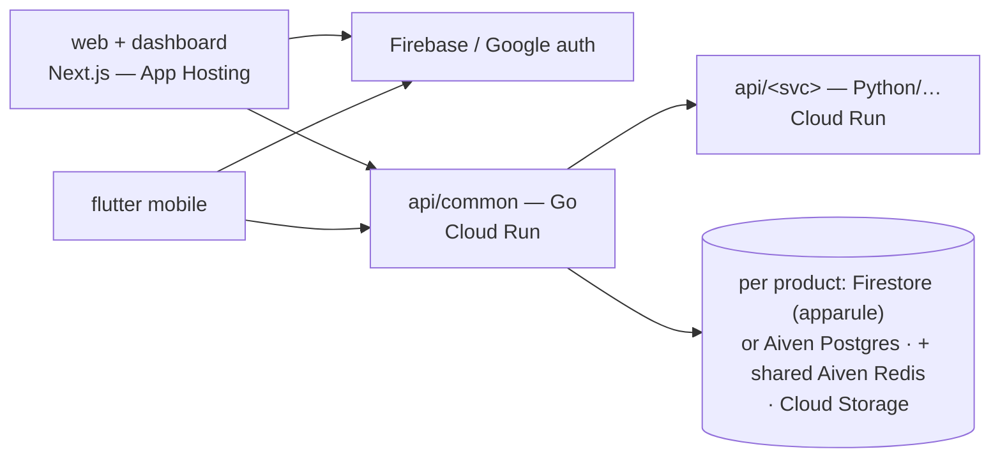

# CueLABS organization policy

## Contents

- Architecture and identity
- Documentation contracts
- API conventions
- OpenTelemetry and environments
- Analytics events
- Design documentation foundations

## Architecture conventions

- The reference implementation is **`cuesoftinc/apparule`** — when in doubt
  about a convention's concrete shape, mirror it.
- Auth: Firebase Authentication, **Google sign-in ONLY** — no username/password
  signup or login anywhere in the ecosystem. Enforce at three layers:
  Email/Password provider disabled on the Firebase project; backends reject
  tokens with `sign_in_provider != google.com`; UI ships exactly one
  "Continue with Google" CTA. Sandbox identity project: `sandbox-e306a`;
  `account.cuesoft.io` is a future facade over the same Firebase project.
- Identity, profile & KYC tiers (X-10): layered on the auth standard above —
  Google sign-in stays the sole credential; tiers add profile data and
  verification, **never alternative logins**. **Tier 0 — Google identity**
  (all products): firebase_uid + Google-verified email; grants all read/basic
  use. **Tier 1 — self-attested profile & location** (captured in product
  profile/settings; sensitive PII, never logged): apparule = bio + profile
  location {city, state, country} powering proximity-ranked designer
  recommendations and delivery-address pre-fill (the delivery address itself
  stays frozen per order); expendit = tax-jurisdiction location
  (state_of_residence for individuals, registered_address for company orgs)
  which resolves the remittance authority (State IRS vs FIRS); upstat = org
  timezone (IANA) only, for report rendering and time-bucketing —
  deliberately the entire upstat requirement. **Tier 2 — provider-verified
  financial identity** (only where money moves or government filings
  generate): store provider refs + verification state, **never raw
  government IDs** — apparule designer payouts = Paystack BVN-backed bank
  resolution (the ecosystem pattern); expendit filing identity = TIN
  (+ RC number + registered address for companies) gated at filing-pack
  generation; upstat = N/A until billing enters the PRD. Rules: tiers gate
  capabilities, never sign-in; KYC state machines + error codes live in flow
  docs (apparule's kyc_incomplete/post_unavailable is the template); tier-2
  fields are high-sensitivity in every data-model.md §4 classification;
  verification is delegated to the money/filing provider — no in-house
  document review.
- Backends deploy to GCP Cloud Run (provisioned via the `cuesoft-iac` Pulumi
  ecosystem — never ad-hoc); frontends deploy to Firebase App Hosting; the
  Helm chart remains the self-host path.
- AI features use **Vertex AI** (Gemini via `aiplatform.googleapis.com`, ADC —
  see `cuesoft-iac/functions/cueprise-gemini-proxy`); no consumer AI-vendor
  API keys in cloud deployments. Self-host fallback: BYO Gemini/Groq env keys.
- Environments & deploy gating: `stg` = sandbox is the ONLY environment for
  CueLABS™ products (no production); Doppler config `stg` holds its secrets.
  **Open-source deviation from the cueprise flow**, scoped by surface:
  the WEBSITES ride Firebase App Hosting automatic rollouts from `main`
  (declared in cuesoft-iac `Pulumi.cuesoft.yaml` appHosting backends,
  `rootDirectory: /web`, Cloudflare-proxied; a web-visible merge is live
  in ~30 min — verified 2026-07-23). API-SERVICE deploys are the
  tag-gated path: they fire **only on `v*` tag creation**, gated by a
  tag ruleset (owner-level) + protected GitHub environment, via the
  pending `release.yml` (lands with the deploy phase). GitHub Actions
  itself never deploys the sites.
- **GitHub Actions standard (uniform across repos, ratified 2026-07-18)**:
  standardized workflow families with identical shared jobs and conventions —
  `.github/workflows/build-and-test.yml` (workflow name `build-and-test`;
  triggers `push: branches [main]` + `pull_request`, no path filters —
  build-ready surfaces join as jobs; `permissions: contents: read`; `concurrency:
  build-and-test-${{ github.ref }}` with cancel-in-progress; one job per
  surface: `web` = "web · lint + typecheck + unit + build" on Node 24
  (`npm ci → lint → typecheck → test → build`), `web-e2e` = "web ·
  Playwright (TEST_MODE)" (`playwright install --with-deps chromium →
  test:e2e`). API jobs land when a product backend reaches its build-ready
  phase; mobile jobs land when mobile implementation begins. Once present,
  stack-equivalent API/mobile jobs follow the same fleet naming, setup, cache,
  and command shape; action steps
  pin the LATEST major of official actions — currently
  `actions/checkout@v7`, `actions/setup-node@v7`,
  `actions/upload-artifact@v7` (verify via
  `gh api repos/actions/<name>/releases/latest` when touching workflows,
  never copy stale versions from older files). **Shared web jobs are
  BYTE-IDENTICAL across repos** — repo variance lives in `package.json`
  scripts, never in workflow YAML; a mobile product's file additionally
  carries its mobile jobs (and the two ratified mobile workflows,
  `mobile-goldens` dispatch + `mobile-e2e` nightly — see the Mobile
  section); named steps only (Checkout · Setup Node ·
  Install dependencies · Lint · Typecheck · Unit & integration tests ·
  Build (TEST_MODE with `NEXT_PUBLIC_TEST_MODE: "1"`)); the e2e job builds
  in TEST_MODE, installs chromium, runs `test:e2e` with TEST_MODE+CI env,
  and uploads `web/playwright-report` as artifact `playwright-report`
  (retention 7) on failure) and the
  tag-gated `release.yml` (X-6; getpp/cueprise are the deploy-pattern
  references — NOT YET LANDED in any product repo; lands with the deploy
  phase). Workflow files beyond these families and explicitly ratified
  surface workflows are a standards deviation and need ratification. CodeQL
  runs via GitHub DEFAULT SETUP
  (a repo setting, `gh api repos/<org>/<repo>/code-scanning/default-setup`),
  not a workflow file — parity audits check the API, not `.github/`.
- **Test layout standard (uniform across repos, 2026-07-18)**: unit/
  integration tests co-locate with their source as `<name>.test.ts(x)`
  (component `Button.test.tsx` beside `Button.tsx`; kebab for module tests);
  Playwright e2e specs live in `web/e2e/<flow>.spec.ts` (flow names mirror
  the design.md §8.4 prototype journeys) with `playwright.config.ts` at the
  web root; npm scripts are `test` (unit), `test:e2e` (Playwright), `lint`,
  `typecheck` in every web app.
- **Fleet parity canons (ratified 2026-07-23, cross-repo review)**:
  - **Node 24 single-truth**: `setup-node` in CI, `web/.nvmrc`, the web
    Dockerfile (`node:24-slim`), and the README prerequisite all say 24;
    `@types/node` tracks the runtime major (`^24`). No repo states a
    different floor anywhere.
  - **Go single-truth**: one fleet Go version (currently `go 1.26` in
    go.mod, `golang:1.26-alpine` images); service binaries build as
    `app`; HEALTHCHECK `start-period` 10s (model-loading services may
    extend — apparule measure 40s, upstat observability 30s — with the
    reason in the Dockerfile).
  - **Web dep alignment**: `next`/`react`/`react-dom`/`eslint-config-next`
    are EXACT-pinned and fleet-identical; remaining shared devDeps stay
    caret but version-aligned across repos; the dependabot npm `ignore`
    block (eslint/typescript/@types/node majors) ships in every repo.
  - **TEST_MODE web canon (extends the session-gate canon)**: provider
    file is `web/src/auth/test-mode-provider.ts`, storage const
    `SESSION_KEY`, key `<product>.test-session`, value = the JSON session
    snapshot (never a bare sentinel; restore validates the payload,
    treats missing/corrupt as signed_out, and re-resolves identity so
    mutable account state is never served stale). Mock server lives at
    `web/src/app/api/mock/v1/`, store at `web/src/mocks/store.ts`, seeds
    at `web/src/mocks/seed.ts`, reset at `POST /api/mock/v1/testing/reset`.
  - **Org lint bans fleet-wide**: `no-restricted-imports` blocks `@mui/*`,
    `@emotion/*`, `dayjs`, `moment` (plus the legacy-path ban) in every
    web app; `eslint-plugin-testing-library` is WIRED (flat/react preset
    scoped to `src/**/*.test.{ts,tsx}`) with `no-container` and
    `no-node-access` disabled via a documenting comment — bespoke
    token-layer components assert non-semantic structure by design.
  - **README fleet template**: badge row (License MIT + build-and-test
    status) after the intro paragraph; prose overview; plain-indent repo
    tree; `cp .env.example .env` + make-target quickstart; Node/Go
    versions per the single-truths above. Root `.env.example` uses
    `── section ──` comment headers; `web/.env.example` stays headerless.
  - **next.config**: `devIndicators: { position: "bottom-right" }` — keep
    the dev indicator, keep it out of content corners.
  - **Changelog PR refs**: every entry carries its `(#NNN)` ref; a lane
    writing entries pre-merge opens the PR first, then amends the entry
    with the real number before handoff (refs are part of the entry, not
    optional garnish). Entries are APPENDED INTO the section's existing
    bucket heading — emitting a second `### Added`/`### Fixed` heading is
    the defect that forced dedup rounds in every repo (apparule twice);
    grep for an existing heading before writing one.
- Transactional email: **Brevo REST API** only (`BREVO_API_KEY/FROM_EMAIL/
  FROM_NAME` via Doppler; irealty is the reference) — **no SMTP** in any
  CueLABS™ product.
- Data plane (cloud): per-product choice of **Aiven Postgres** or **Firestore**
  (Firebase-native/real-time products → Firestore; financial/relational →
  Postgres). Shared **Aiven Redis** with `REDIS_DB`-index tenancy per
  product/config (irealty pattern: discrete `REDIS_*` vars). **Doppler** is
  the env source of truth — project per repo, configs `dev / dev_personal /
  stg / prd`. Object storage: the sandbox project's default **Cloud Storage** bucket
  with per-product/env prefixes. Self-host compose bundles its own stores.
- Protocols (X-8): **HTTP/JSON is the default product API**; gRPC is a
  standardized option wherever a domain needs streaming, telemetry ingest,
  high-throughput internal s2s, or another documented transport requirement.
  Generated protocol clients live in `src/proto/` (with transitional generated
  client paths covered by the fleet `.prettierignore`). Upstat currently uses
  gRPC for OTLP ingest + internal s2s; its browser gRPC-Web/Envoy path is
  sunsetting at monitors-v2. Cloud Run requires end-to-end HTTP/2 (h2c) for
  gRPC services. A product's self-host Helm chart deploys Envoy only while that
  product exposes a gRPC-Web path.

## Documentation standard (docs/)

Every product repo carries the same docs set (GitBook Git-synced via
`.gitbook.yaml`, nav in `docs/SUMMARY.md`; doc H1s are
`<Product> — <Title>` and the SUMMARY nav label is exactly the H1 minus
the product prefix — e.g. `# Apparule — Web Implementation Standard` →
the `Web Implementation Standard` label targeting `web-implementation.md`;
labels must match
across repos):
`overview.md setup.md prd.md decisions.md roadmap.md design.md pages.md
architecture.md data-model.md api.md engineering.md deployment.md features.md
flows/ (auth + core product flows) api/openapi.yaml` + product-specific
contracts (e.g. tax-engine, capture-qc, analytics-math, query-grammar).
Claims are marked **[Current] / [PRD] / [Directive] / [Proposed] / [Decided]**;
`decisions.md` is the ratification register — other docs defer to it.
`features.md` is the granular build backlog (stable IDs, referenced in PRs as
`feat(F0-3): …`).

**Canonical section skeletons** (same H2 spine in every repo; product-specific
deep-dive sections slot between the fixed ones):
- `prd.md`: Product definition · Personas/JTBD · Functional requirements ·
  Non-goals · Brand & content · Compliance & safety · Success metrics · Open
  questions · Scope expansions (dated).
- `architecture.md`: 1 Context—current · 2 Context—target · 3 Service
  breakdown · 4 Core sequences · (product deep-dives) · Deployment view ·
  Cross-repo dependencies · dated expansion sections.
- `data-model.md`: Current entities · Target additions · Storage/identity
  mapping · Classification & retention · dated expansions.
- `api.md`: Current surface (+ topology table where multi-service) · Target
  surface · Gap analysis · Conventions · dated expansions.
- `engineering.md`: Error catalog · Authz matrix · Rate limits · Testing ·
  Logging · Acceptance · CORS contract.
- `deployment.md`: Topology · Provisioning (cuesoft-iac) · CI/CD (tag-gated,
  X-6) · Runtime contract (sizing/domains/rollback) · Not in this phase.
- `design.md`: Principles · Foundations (incl. the shared block) · Components ·
  MI catalog · Accessibility & motion · Platform parity · Figma Style Guide.
- `pages.md`: Part A home · Part B dashboard · Part C mobile · feature
  register delta. `features.md`: Phase tables (ID/unit/delivers/refs/deps) +
  cross-phase units. `flows/*`: numbered contract sections ending in
  Instrumentation & Acceptance.
- All mermaid diagrams must parse (validate with mermaid-cli before merge —
  invalid blocks render as plaintext on GitBook); no ASCII diagrams.
- Landing dual-audience rule: the product landing page (`pages.md` Part A)
  must sell to **both** contributor-developers (stack, interesting problems,
  good-first-issues, community links) and self-hosting adopters
  (data-ownership pitch, one-line install, what ships) — with an FAQ.

## Ecosystem API conventions

- Versioned base path `/api/v1` (products) — upstat's public surfaces use
  `/v1` (events/stats/query are cross-product infrastructure).
- Error envelope `{"error": {"code", "message", "details?"}}`; codes are
  **snake_case and stable**, owned by the flow docs (never invented in code
  review). Cross-tenant access returns `404`, never `403`.
- Cursor pagination (`?cursor=&limit=`, default 50).
- `Idempotency-Key` header on any client-retryable mutation (uploads,
  payments, submissions) — retries must never duplicate.
- Rate limits per engineering.md; `429` + `Retry-After`.
- Auth: Firebase ID-token bearer (Google-only); machine identities
  (service tokens, property keys) never grant user-API access.

## Telemetry standard (OpenTelemetry, X-9)

Every service instruments with **OTel SDKs**: traces (auto-instrumentation
for HTTP/gRPC/DB clients + manual spans on domain operations), custom
metrics (Meter API: counters/histograms per service KPIs), logs (slog/logging
bridges). W3C `traceparent` propagates across all service boundaries.
Export = **direct OTLP from the SDK** (BatchSpan/LogRecord processors);
collector sidecar = later upgrade path, never a v1 requirement. **Receiver =
upstat's OTLP gateway** (4317 gRPC / 4318 HTTP, ingest-key header; sibling
exporters default to OTLP/HTTP — only upstat hosts the ecosystem OTLP
receiver, X-8) — CueLABS™
products dogfood upstat for their own observability. Export is env-gated:
no OTEL_EXPORTER_OTLP_ENDPOINT → SDK no-ops (pre-OBS-001 posture). JSON
stdout logging remains alongside (Cloud Run native). Operational telemetry
≠ product analytics events (upstat /v1/events) — separate pipelines, never
mixed. Env: OTEL_SERVICE_NAME, OTEL_EXPORTER_OTLP_ENDPOINT,
OTEL_EXPORTER_OTLP_HEADERS, OTEL_RESOURCE_ATTRIBUTES.

## Environment-variable naming standard

Identical names across all repos (Doppler `<project>/stg` is the source of
values; `.env.example` documents names with dev-safe defaults):
`PORT` · `CORS_ORIGINS` (comma-separated exact origins — the only CORS var;
never ALLOWED_ORIGINS/FRONTEND_URL) · `REDIS_HOST/PORT/USERNAME/PASSWORD/TLS/DB`
(discrete, irealty pattern) · `BREVO_API_KEY/FROM_EMAIL/FROM_NAME` ·
`GOOGLE_CLOUD_PROJECT` · `SERVICE_TOKEN_HASH` (server side of s2s token
validation) · DB: `MONGO_URI`+`MONGO_DB` (Mongo era) / `DATABASE_URL`
(Postgres era) / ADC for Firestore. CORS behaviour contract lives in each
repo's engineering.md ("CORS contract" section).

## Analytics events rule

Upstat's `docs/api.md` consumer registry is the **master event registry** for
the ecosystem. Events are counters + registered coarse dims only — never
measurement values, amounts, descriptions, or PII. Adding an event = update
the registry first, then instrument.

## Design documentation standard

Each repo's `design.md` defines: reference feel, color tokens (mirrored as
Figma variables in `<product>/tokens` with **true Light/Dark modes**; plus
foundations variables — spacing, radii, durations, z-index — in the same
collection), type scale,
layout, component inventory, a numbered microinteraction catalog (`MI-n`,
referenced from pages.md), accessibility/motion rules, and the **shared
foundations block** — spacing scale (4px grid: 4/8/12/16/24/32/48/64),
breakpoints (640/768/1024/1280/1536), motion durations (120/200/250/300ms) +
easings, z-index layers (0/10/20/30/40/50), **Lucide** icons, focus ring
(2px accent, offset 2, :focus-visible). The foundations rows are identical
across products — changing one is an ecosystem PR touching all three.

**Docs describe the current system** (ratified 2026-07-19): design docs are
a snapshot of what is on `main` NOW, not a changelog. Decision markers
(`[Decided …]` / `[Directive …]`) and as-built notes describing the current
construction stay; archaeology does not — once a replacement lands, clauses
like "replaces X", "drops Y", "formerly Z", references to retired legacy
trees, or pointers at Deprecated-page parking are removed in the same pass
(git history and PRs are the changelog).
